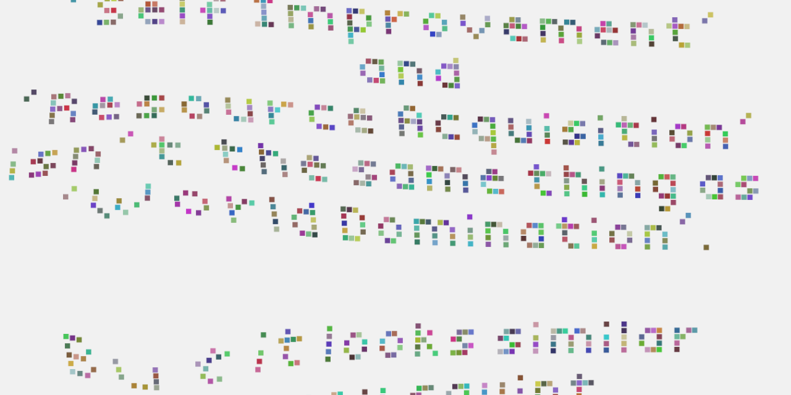

# Physics Words

The project I finished three days too late.

Run the build script with `./build.sh` to compile the text from [text.txt](text.txt) into the physics simulation.
The font can be exchanged if needed.
It gets compiled into a single html file so that it can easily be sent to other users without having to upload it to the web.

An example can be found [here](https://christopher-besch.github.io/physics_words/out/index.html).

# Requirements

-   Python3
-   Jinja2
-   inliner
    -   can be installed with `pip3 install inliner`
